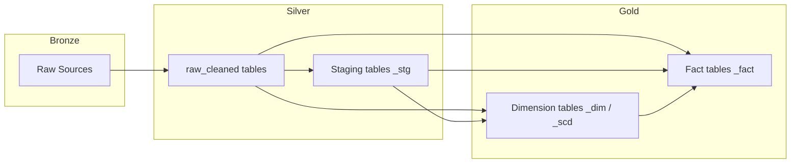
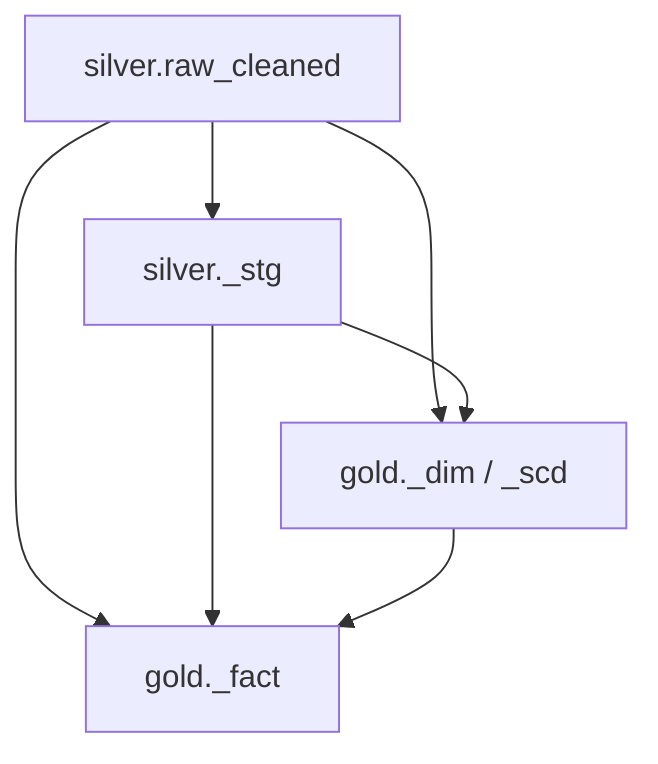

# ETL Meta Plan — Universal 6-Step Framework

> **Version:** 1.1
> **Last Updated:** 2026-03-02
> **Scope:** Databricks / PySpark / Delta Lake — Staging, Dimension, and Fact tables  
> **Audience:** AI Agents and Data Engineers building new ETL pipelines from scratch

---

## Table of Contents

1. [Overview](#1-overview)
2. [ETL Layer Reference Guide](#2-etl-layer-reference-guide)
3. [Universal 6-Step ETL Framework](#3-universal-6-step-etl-framework)
   - [Step 1 — Declare Functions](#step-1--declare-functions-imports)
   - [Step 2 — Declare Table](#step-2--declare-table-definition)
   - [Step 3 — Get Commit Timestamp](#step-3--get-commit-timestamp)
   - [Step 4 — Get Source Data](#step-4--get-source-data)
   - [Step 5 — ETL Process](#step-5--etl-process)
   - [Step 6 — Upsert Process](#step-6--upsert-process)
4. [Quality and Improvement Standards](#4-quality-and-improvement-standards)
5. [AI Agent Execution Checklist](#5-ai-agent-execution-checklist)

---

## 1. Overview

### Purpose

This Meta Plan is a **self-contained, table-agnostic** blueprint that any AI Agent or Data Engineer can follow to build a correct ETL pipeline for **any new table** — whether it is a staging table, a dimension table, or a fact table — within the Lakehouse platform.

### How to Use

1. **Determine the target layer** (staging / dim / fact) and consult [Section 2](#2-etl-layer-reference-guide) for layer-specific rules.
2. **Follow the 6 steps** in [Section 3](#3-universal-6-step-etl-framework) sequentially. Each step contains an objective, standard approach, decision rules, pitfalls, and a generalized code template.
3. **Apply the quality standards** in [Section 4](#4-quality-and-improvement-standards) — these are corrections to anti-patterns found in earlier implementations and are now the default standard.
4. **Use the execution checklist** in [Section 5](#5-ai-agent-execution-checklist) as a final gate before declaring the pipeline complete.

### Architecture Overview



### Key Modules Reference

| Module | Import Path | Purpose |
|--------|-------------|---------|
| `CATALOG_NAME` | `configs` | Environment-aware catalog name |
| `get_commit_timestamp` | `modules.commit_timestamp` | Retrieve incremental watermark for a table |
| `upsert_commit_timestamp` | `modules.commit_timestamp` | Persist watermark after successful upsert |
| `upsert_dataframe` | `modules.table_utils` | Delta MERGE with auto-managed audit columns |
| `max_by_group` | `modules.utils` | Deduplicate: keep row with max value per group |
| `min_by_group` | `modules.utils` | Deduplicate: keep row with min value per group |
| `estimate_df_size` | `modules.utils` | Estimate DataFrame size for broadcast decisions |
| `filter_and_prepare` | `modules.utils` | Select, join, optionally repartition and cache a DataFrame in one call |
| `materialize_dataframe` | `modules.utils` | Write DataFrame to temp storage and read back to cut Spark lineage; returns `(df, tmp_path)` |
| `dematerialize_dataframe` | `modules.utils` | Delete the temporary folder created by `materialize_dataframe` |
| `get_change_events` | `modules.extraction.change_extraction` | Read Delta CDF for incremental extraction |
| `SCDHandler` | `modules.scdhandler` | SCD Type 2 change detection and versioning |

---

## 2. ETL Layer Reference Guide

### 2.1 Staging Layer (`_stg`)

| Attribute | Rule |
|-----------|------|
| **Schema** | `{CATALOG_NAME}.silver` |
| **Naming** | `<domain>_<description>_stg` |
| **Tracking Table** | `'silver'` |
| **Purpose** | Pre-aggregate, reshape, or enrich raw_cleaned data before consumption by gold-layer tables. Staging tables exist when the transformation from raw to gold is complex enough to warrant an intermediate step. |
| **Grain** | Defined by composite business keys from the source system. |
| **Source Layer** | Silver `raw_cleaned` tables only. Never reads from gold. |
| **Surrogate Keys** | **Not used.** Composite natural keys from source. |
| **`is_deleted` Column** | **Required.** `BOOLEAN DEFAULT FALSE`. Enables soft-delete via `whenNotMatchedBySourceUpdate`. |
| **Soft-Delete Behavior** | Rows absent from the source DataFrame are marked `is_deleted = TRUE` (not physically deleted). |
| **Business Logic** | Allowed: joins, filters, unions, type casting, basic aggregations. Domain-specific business logic should be extracted into `business/` module functions. |

### 2.2 Dimension Layer (`_dim` / `_scd`)

| Attribute | Rule |
|-----------|------|
| **Schema** | `{CATALOG_NAME}.gold` |
| **Naming** | `<entity>_dim` (Type 1) or `<entity>_scd` (Type 2) |
| **Tracking Table** | `'gold'` |
| **Purpose** | Store descriptive attributes for analytical entities. One row per entity (Type 1) or one row per entity per version (Type 2 SCD). |
| **Grain** | One row per entity (dim) or one row per entity-version (scd). |
| **Source Layer** | Silver `raw_cleaned` tables, or silver staging tables. |
| **Surrogate Keys** | **Required.** `BIGINT PRIMARY KEY GENERATED BY DEFAULT AS IDENTITY`. Named `<entity>_id`. |
| **`__id` Column** | **Required for dims with surrogate keys.** Stores the source-system technical ID for ETL traceability. Used as `composite_keys` for merge matching. Never exposed to business users. |
| **`is_deleted` Column** | **Required.** `BOOLEAN DEFAULT FALSE`. |
| **SCD Type 2 Columns** | For `_scd` tables: include `effective_date DATE` (or `effective_start_date` / `effective_end_date` pair). |
| **Hierarchy Support** | Dimension tables should include hierarchical attributes when applicable to support drill-down and roll-up reporting. |
| **Value Decoding** | Integer codes from source systems MUST be decoded to human-readable strings in the dimension. Use `F.when().otherwise()` chains. |
| **Unknown/Default Row** | Use surrogate key `-1` to represent unknown/not specified. Fact tables reference `-1` when the source value is NULL. |

### 2.3 Fact Layer (`_fact`)

| Attribute | Rule |
|-----------|------|
| **Schema** | `{CATALOG_NAME}.gold` |
| **Naming** | `<process>_<granularity>_fact` (e.g., `_accumulating_snapshot_fact`, `_daily_fact`) |
| **Tracking Table** | `'gold'` |
| **Purpose** | Store measurable business events or process snapshots with foreign keys to dimensions. |
| **Grain** | Clearly defined per table (e.g., one row per candidate per application). Must be documented in the table comment. |
| **Source Layer** | Silver `raw_cleaned` tables, silver staging tables, **and** gold dimension tables. |
| **Surrogate Keys** | **Not typically used as PK.** The grain is defined by foreign keys. |
| **Foreign Keys** | **Required.** Explicit `FOREIGN KEY REFERENCES` to dimension tables. |
| **`is_deleted` Column** | **Required.** `BOOLEAN DEFAULT FALSE`. |
| **Measures** | Include additive counters (quantity fields), timestamps (role-playing dates), calculated KPIs (lag metrics), and scores. |
| **DEFAULT Values on Measures** | Nullable measure columns SHOULD specify `DEFAULT 0` (numeric) or `DEFAULT FALSE` (boolean) in the DDL. This ensures rows inserted outside the ETL pipeline default to sensible values and simplifies downstream `fillna` handling. |
| **FK Lookup Pattern** | See [Step 5 Decision Rules](#fk-lookup-pattern). |
| **Null Timestamps** | Replace NULL timestamps with sentinel value `9999-12-31 23:59:59` and NULL dates with `9999-12-31` for consistent sorting and filtering. |
| **Role-Playing Dimensions** | When the same dimension is referenced multiple times (e.g., multiple branches), create separate FK columns with descriptive names and join the dimension table with distinct aliases. |
| **Periodic Snapshot Pattern** | For month-end or daily snapshot facts, generate a date spine (calendar) DataFrame per entity, then left-join all metric sub-DataFrames to the spine. See [Step 5 — Periodic Snapshot Spine Pattern](#periodic-snapshot-spine-pattern). |

### Layer Dependency Flow



> **CRITICAL:** Fact table pipelines MUST be orchestrated to run AFTER all upstream dimension and staging pipelines have completed.

---

## 3. Universal 6-Step ETL Framework

Every ETL notebook MUST follow these 6 steps in order. Each step occupies its own Databricks notebook section separated by markdown headers and `---` dividers.

---

### Step 1 — Declare Functions (Imports)

#### Objective
Import all required modules and functions at the top of the notebook. No business logic here.

#### Standard Approach

```python
# Databricks notebook source
# MAGIC %md
# MAGIC # Functions

# COMMAND ----------

import datetime
from pyspark.sql import functions as F, Window
from configs import CATALOG_NAME
from modules.commit_timestamp import get_commit_timestamp, upsert_commit_timestamp
from modules.table_utils import upsert_dataframe
# Import ONLY what you need from modules.utils:
from modules.utils import max_by_group          # if deduplication needed
from modules.utils import estimate_df_size      # if broadcast decisions needed
# Import domain-specific business logic:
from business.<domain>.<module> import <function>  # if applicable

# COMMAND ----------

# MAGIC %md
# MAGIC ---
```

#### Decision Rules

| Condition | Action |
|-----------|--------|
| Pipeline needs deduplication (keep latest row per group) | Import `max_by_group` from `modules.utils` |
| Pipeline uses CDF for incremental reads | Import `get_change_events` from `modules.extraction.change_extraction` |
| Pipeline requires SCD Type 2 handling | Import `SCDHandler` from `modules.scdhandler` |
| Domain-specific transformation logic exists | Import from `business/<domain>/` module |
| Pipeline needs broadcast decision support | Import `estimate_df_size` from `modules.utils` |

#### Pitfalls to Avoid

| Anti-Pattern | Corrected Standard |
|---|---|
| Importing functions that are never used (e.g., importing `get_change_events` when the notebook reads full tables, or importing `estimate_df_size` without calling it) | **Import ONLY what is actually used.** Audit imports after completing Step 5 and remove any unused ones. |
| Importing `from pyspark.sql.functions import *` (wildcard) | **Always use** `from pyspark.sql import functions as F` and prefix all function calls with `F.` for namespace clarity. The `modules/` codebase uses wildcard imports internally; do NOT replicate this in feature notebooks. |
| Placing business logic or variable declarations in Step 1 | Step 1 is for imports only. All logic belongs in Steps 2–6. |

---

### Step 2 — Declare Table (Definition)

#### Objective
Define the target table name, composite keys, and the `CREATE TABLE IF NOT EXISTS` DDL. This step is idempotent — it creates the table only if it does not already exist.

#### Standard Approach

```python
# MAGIC %md
# MAGIC # Table Definition

# COMMAND ----------

table_name = f"{CATALOG_NAME}.<schema>.<table_name>"
composite_keys = ["<key_col_1>", "<key_col_2>"]

# COMMAND ----------

spark.sql(f"""
    CREATE TABLE IF NOT EXISTS {table_name} (
        -- Surrogate key (dim/scd only)
        <entity>_id BIGINT PRIMARY KEY GENERATED BY DEFAULT AS IDENTITY
            COMMENT "...",

        -- Business columns
        <column_name> <DATA_TYPE> [DEFAULT <value>]
            COMMENT "**EN:** <English description>\n\n**TH:** <Thai description>",

        -- Soft-delete flag (all layers)
        is_deleted BOOLEAN DEFAULT FALSE
            COMMENT "**EN:** Logical deletion flag (soft delete).\n\n**TH:** ระบุว่าข้อมูลนี้ถูกลบ (soft delete) หรือไม่",

        -- ETL traceability (dim/scd only)
        __id BIGINT
            COMMENT "**EN:** Technical identifier from source system for ETL traceability.\n\n**TH:** รหัสทางเทคนิคจากระบบต้นทาง",

        -- Audit columns (all layers)
        __created_at INT
            COMMENT "**EN:** Date when record was created (yyyyMMdd).\n\n**TH:** วันที่สร้างข้อมูล (yyyyMMdd)",

        __updated_at INT
            COMMENT "**EN:** Date when record was last updated (yyyyMMdd).\n\n**TH:** วันที่ปรับปรุงข้อมูลล่าสุด (yyyyMMdd)"
    )
    CLUSTER BY (
        <clustering_columns>
    )
    TBLPROPERTIES (
        'delta.enableChangeDataFeed' = 'true',
        'mergeSchema' = 'true',
        'delta.feature.allowColumnDefaults' = 'supported',
        'comment' = "**EN:** <table purpose, grain, and usage>\n\n**TH:** <Thai translation>"
    );
""")

# COMMAND ----------

# MAGIC %md
# MAGIC ---
```

#### Decision Rules

| Decision | Staging (`_stg`) | Dimension (`_dim`/`_scd`) | Fact (`_fact`) |
|----------|------------------|---------------------------|----------------|
| Schema | `silver` | `gold` | `gold` |
| Surrogate Key | ❌ No | ✅ `GENERATED BY DEFAULT AS IDENTITY` | ❌ No (uses FK composite) |
| `__id` column | ❌ No | ✅ Yes (source system PK) | ❌ No |
| `is_deleted` | ✅ Yes | ✅ Yes | ✅ Yes |
| `FOREIGN KEY REFERENCES` | ❌ No | ❌ No | ✅ Yes |
| `composite_keys` | Source natural keys | `["__id"]` (or a set of natural business keys for dims without `__id`) | Dimension surrogate FK(s) |
| `CLUSTER BY` | Composite keys | Surrogate key + high-cardinality filter columns | Primary FKs used in joins |
| `DEFAULT` on measures | ⚠️ Optional | ⚠️ Optional | ✅ Recommended — `DEFAULT 0` for numeric, `DEFAULT FALSE` for boolean |
| Column COMMENTs | Bilingual (EN/TH) | Bilingual (EN/TH) | Bilingual (EN/TH) |
| Table COMMENT | In `TBLPROPERTIES` `'comment'` | In `TBLPROPERTIES` `'comment'` | In `TBLPROPERTIES` `'comment'` — must specify the **grain** |

#### Mandatory TBLPROPERTIES

Every table MUST have these four properties:

```sql
'delta.enableChangeDataFeed' = 'true',
'mergeSchema' = 'true',
'delta.feature.allowColumnDefaults' = 'supported',
'comment' = '<bilingual table description including grain>'
```

#### Pitfalls to Avoid

| Anti-Pattern | Corrected Standard |
|---|---|
| Omitting `DEFAULT FALSE` on `is_deleted` | Always include `DEFAULT FALSE` so new rows inserted outside the ETL default to not-deleted. |
| Using `STRING` for dates that should be `DATE` or `TIMESTAMP` | Use the strongest applicable type: `DATE` for date-only, `TIMESTAMP` for datetime, `INT` for yyyyMMdd audit fields. |
| Omitting the grain definition in the table comment | The table comment in TBLPROPERTIES MUST explicitly state the grain (e.g., "one row per candidate per application"). |
| Forgetting `CLUSTER BY` | Always include `CLUSTER BY` with columns most frequently used in join/filter predicates. |

---

### Step 3 — Get Commit Timestamp

#### Objective
Retrieve the incremental processing watermark (`start_point`, `end_point`) for the target table. This defines the time window for incremental processing.

#### Standard Approach

```python
# MAGIC %md
# MAGIC # Get Commit Timestamp

# COMMAND ----------

start_point, end_point = get_commit_timestamp(table_name, '<tracking_table>')
end_point_th = end_point + datetime.timedelta(hours=7)

# COMMAND ----------

# MAGIC %md
# MAGIC ---
```

#### Decision Rules

| Layer | `tracking_table` Value |
|-------|----------------------|
| Staging (`silver`) | `'silver'` |
| Dimension (`gold`) | `'gold'` |
| Fact (`gold`) | `'gold'` |

#### Semantics

- `start_point`: The last successfully processed timestamp (or `None` on first run). Represents "where we left off."
- `end_point`: Current UTC time (or manual override via widget). Represents "process up to here."
- `end_point_th`: Thai local time (UTC+7). Use this for any business logic that requires local time (e.g., calculating active status relative to the current Thai date).

#### Pitfalls to Avoid

| Anti-Pattern | Corrected Standard |
|---|---|
| Computing `end_point_th` but never using it | **Only compute `end_point_th` if the ETL logic actually requires Thai local time** (e.g., date-based flags, age calculations relative to local date). If unused, omit it. |
| Ignoring `start_point` in the ETL step (doing full recomputation every run) | **Use `start_point` to filter source data** for incremental processing wherever feasible. See [Step 4](#step-4--get-source-data) and [Quality Standard QS-01](#qs-01-incremental-source-filtering). |

---

### Step 4 — Get Source Data

#### Objective
Load all source DataFrames needed for the ETL step. Organize them in a dictionary keyed by table name for clean referencing.

#### Standard Approach

```python
# MAGIC %md
# MAGIC # Source Data

# COMMAND ----------

# DBTITLE 1,silver
silver_tables = [
    "<source_system>_<table_1>",
    "<source_system>_<table_2>",
]
silver_dfs = {
    tbl: spark.table(f"{CATALOG_NAME}.silver.{tbl}_raw_cleaned").alias(f"{tbl}_df")
    for tbl in silver_tables
}

# COMMAND ----------

# DBTITLE 1,stg (when reading from staging tables)
stg_tables = [
    "<domain>_<description>_stg",
]
stg_dfs = {
    tbl: spark.table(f"{CATALOG_NAME}.silver.{tbl}").alias(f"{tbl}_df")
    for tbl in stg_tables
}

# COMMAND ----------

# DBTITLE 1,gold (fact tables only)
gold_tables = [
    "<dimension_1>",
    "<dimension_2>",
]
gold_dfs = {
    tbl: spark.table(f"{CATALOG_NAME}.gold.{tbl}").alias(f"{tbl}_df")
    for tbl in gold_tables
}

# COMMAND ----------

# MAGIC %md
# MAGIC ---
```

#### Decision Rules

| Layer | Silver Sources (`silver_dfs`) | Staging Sources (`stg_dfs`) | Gold Sources (`gold_dfs`) |
|-------|-------------------------------|----------------------------|--------------------------|
| Staging | ✅ `raw_cleaned` tables only | ❌ Never | ❌ Never |
| Dimension | ✅ `raw_cleaned` tables | ⚠️ Rarely (when pre-aggregated staging exists) | ⚠️ Rarely (only cross-referencing other dims) |
| Fact | ✅ `raw_cleaned` tables | ✅ Staging tables for pre-aggregated data | ✅ Dimension tables for FK lookups |

> **Note on `stg_dfs`:** When a pipeline reads from silver staging tables (`_stg`), declare them in a **separate `stg_dfs` dictionary**. Staging tables live in the `silver` schema but do NOT have the `_raw_cleaned` suffix — they are loaded as `spark.table(f"{CATALOG_NAME}.silver.{tbl}")`. This three-dictionary pattern (`silver_dfs`, `stg_dfs`, `gold_dfs`) makes source-layer dependencies immediately visible.

#### Alias Convention

- Silver tables: `spark.table(...).alias(f"{tbl}_df")` — the alias uses the table list key + `_df` suffix.
- Gold tables: `spark.table(...).alias(f"{tbl}_df")` — same pattern.
- Role-playing dimensions (same dim joined multiple times): Use descriptive aliases like `.alias('offer_preferred_branch_df')`, `.alias('internship_branch_df')`.

#### Pitfalls to Avoid

| Anti-Pattern | Corrected Standard |
|---|---|
| Hardcoding full table paths inline in ETL code | **Always define source tables in the dictionary pattern.** This centralizes source declarations and makes dependencies explicit. |
| Reading gold dimension tables in staging pipelines | **Staging tables must only read from silver.** Gold reads are reserved for fact (and rarely dim) pipelines. |
| Not aliasing DataFrames | **Always alias** every DataFrame at load time to prevent ambiguous column references in joins. |

---

### Step 5 — ETL Process

#### Objective
Transform, join, filter, aggregate, and prepare the source data into the final `upsert_df` DataFrame that matches the target table schema exactly (excluding `__created_at` and `__updated_at` which are auto-managed by `upsert_dataframe`).

#### Standard Approach — Layer-Specific Patterns

##### Staging Pattern

```python
# MAGIC %md
# MAGIC # ETL

# COMMAND ----------

# Sub-DataFrame 1 (e.g., by product type)
sub_df_1 = (
    silver_dfs['<main_table>']
    .filter(<condition>)
    .join(
        silver_dfs['<related_table>'].hint('broadcast'),
        <join_condition>,
        '<join_type>'
    )
    .select(
        F.col('<alias>.<col>').alias('<target_col>'),
        ...
    )
)

# Sub-DataFrame 2
sub_df_2 = (...)

# Union all sub-DataFrames
union_df = (
    sub_df_1
    .unionByName(sub_df_2, allowMissingColumns=True)
    .fillna({'<nullable_key_col>': <default_value>})
)

# Final select matching target schema
upsert_df = (
    union_df
    .select(
        union_df.<col_1>,
        union_df.<col_2>,
        ...
    )
)
```

##### Dimension Pattern

```python
# Source transformation
source_df = (
    silver_dfs['<source_table>']
    .withColumns({
        '<new_col>': <transformation_expression>,
        ...
    })
    .select(...)
)

# Deduplication (if needed)
source_df = max_by_group(source_df, ['<group_key>'], '<order_col>')

# For dims that join multiple sources
upsert_df = (
    source_df_1
    .join(source_df_2, <join_condition>)
    .withColumns({
        '<decoded_col>':
            F.when(F.col('<src>') == 1, F.lit('Label A'))
            .when(F.col('<src>') == 2, F.lit('Label B'))
            .otherwise(F.lit('Unknown')),
        'is_deleted': F.lit(False),
    })
    .select(...)
)
```

##### Fact Pattern

```python
# Step A: Transform silver sources
silver_transformed = (
    silver_dfs['<source>']
    .withColumns({...})
    .select(...)
)
silver_transformed = max_by_group(silver_transformed, ['<key>'], '<ts_col>')

# Step B: Join with gold dimensions for FK lookups
fact_df = (
    silver_transformed
    .join(
        gold_dfs['<dim_table>'].hint('broadcast'),
        <join_condition>,
        'left'
    )
    .withColumns({
        # FK Lookup Pattern (see below)
        '<dim>_id':
            F.when(
                source_col.isNotNull() & F.col('<dim>_df.<surrogate_key>').isNull(),
                F.lit(None)  # Data quality issue: source has value but dim lookup failed
            )
            .when(source_col.isNull(), F.lit(-1))  # Unknown/not specified
            .otherwise(F.col('<dim>_df.<surrogate_key>')),
    })
    .select(...)
)

# Step C: Compute derived metrics
upsert_df = (
    fact_df
    .withColumns({
        '<lag_metric>':
            F.when(
                F.col('<start_ts>').isNull() | F.col('<end_ts>').isNull(),
                F.lit(None).cast('<target_type>')
            ).otherwise(
                (<calculation_expression>)
            ).cast('<target_type>'),
    })
    .select(...)
)

# Step D: Handle NULL timestamps (accumulating snapshots)
sentinel_ts = F.to_timestamp(F.lit("9999-12-31 23:59:59"))
ts_cols = ['<ts_col_1>', '<ts_col_2>', ...]
for c in ts_cols:
    upsert_df = upsert_df.withColumn(
        c,
        F.when(F.col(c).isNull(), sentinel_ts)
        .otherwise(F.to_timestamp(F.col(c)))
    )
```

#### Periodic Snapshot Spine Pattern

For **periodic snapshot fact tables** (e.g., month-end summaries, daily snapshots), generate a date spine (calendar) per entity and then left-join all metric sub-DataFrames onto it. This guarantees one row per entity per period, even when some metrics have no data for a given period.

```python
# Step A: Build the date spine (calendar) per entity
spine_df = (
    gold_dfs['<entity>_dim']
    .filter(~F.col('<dim>_df.is_deleted'))
    .withColumns({
        'start_date': F.last_day(F.to_date(F.col('<dim>_df.<effective_date>'), 'yyyyMMdd')),
        'end_date':   F.last_day(F.coalesce(
            F.to_date(F.col('<dim>_df.<end_date>'), 'yyyyMMdd'),
            F.to_date(F.lit(end_point_th))
        )),
    })
    .withColumn(
        'date',
        F.explode(F.sequence(F.col('start_date'), F.col('end_date'), F.expr('INTERVAL 1 MONTH')))
    )
    .withColumns({
        'date': F.last_day(F.col('date')),
        'date_id': F.date_format(F.last_day(F.col('date')), 'yyyyMMdd').cast('INT'),
    })
    .select(
        F.col('<dim>_df.<surrogate_key>').alias('<entity>_id'),
        F.col('<source_key_col>').alias('__<source_key>'),  # internal join key
        F.col('date'),
        F.col('date_id'),
    )
    .repartition('__<source_key>')
    .cache()  # Cache the spine — it is joined by every sub-DataFrame
)

# Step B–N: Build each metric sub-DataFrame, then left-join to spine
metric_1_df = (...)  # Aggregations keyed by (__<source_key>, date)
metric_2_df = (...)

# Step Final: Merge all metrics onto the spine
upsert_df = (
    spine_df
    .join(metric_1_df.hint('shuffle_hash'), ['__<source_key>', 'date'], 'left')
    .join(metric_2_df.hint('shuffle_hash'), ['__<source_key>', 'date'], 'left')
    ...
    .fillna({<column_defaults_dict>})  # Bulk fillna for all nullable measures
    .select(...)
)
```

**Key principles:**
- The spine guarantees completeness — every entity has a row for every period, regardless of whether data exists.
- **`.cache()`** the spine DataFrame because it is reused across many joins (see [Performance Patterns](#performance-patterns) below).
- **`.repartition('<join_key>')`** the spine and all sub-DataFrames on the common join key for efficient shuffle joins.
- Each metric sub-DataFrame is computed independently, making the pipeline modular and testable.

#### Sub-Section Structure for Complex ETL

When Step 5 involves **5 or more** intermediate sub-DataFrames, organize them into sub-sections using `## <Section Name>` markdown headers within the ETL step. Each sub-section should group logically related transformations:

```
# MAGIC %md
# MAGIC ## Loan Balance          ← Sub-section header

# COMMAND ----------
<balance sub-DataFrames>
# COMMAND ----------

# MAGIC %md
# MAGIC ## Loan Repayment        ← Sub-section header

# COMMAND ----------
<repayment sub-DataFrames>
# COMMAND ----------

# MAGIC %md
# MAGIC ## Merge                 ← Final merge sub-section

# COMMAND ----------
<upsert_df assembly>
```

This improves notebook navigation, makes code reviews easier, and allows each sub-section to be run and debugged independently.

#### Performance Patterns

##### `.repartition()` for Partition Alignment

When joining two large DataFrames on the same key, **pre-repartition both sides** on that key to minimize shuffle overhead:

```python
# Repartition intermediate DataFrames on the common join key
sub_df_a = sub_df_a.repartition('<join_key>')
sub_df_b = sub_df_b.repartition('<join_key>')

# Join with shuffle_hash for efficient co-located merge
result = sub_df_a.join(sub_df_b.hint('shuffle_hash'), ['<join_key>'], 'left')
```

**When to repartition:**
- The DataFrame will be joined with 2+ other DataFrames on the same key (amortizes shuffle cost)
- The DataFrame is used as a spine/anchor in a periodic snapshot pipeline
- After a `groupBy().agg()` produces a new partition layout that misaligns with downstream joins

**When NOT to repartition:**
- Small DataFrames that will be broadcast
- Single-use DataFrames joined only once (the join itself will shuffle)

##### `.cache()` for Reused DataFrames

When a DataFrame is **referenced in 2+ joins or actions**, cache it to avoid recomputation:

```python
spine_df = spine_df.repartition('<key>').cache()
```

**Rules:**
- Only cache DataFrames that are reused multiple times downstream.
- Prefer `.cache()` over `.persist()` unless you need a specific storage level.
- For very large intermediate DataFrames in **CDF-based pipelines** where Spark lineage becomes a performance bottleneck, use [`materialize_dataframe()`](modules/utils.py) to write to temp storage and read back, cutting the lineage graph. Call [`dematerialize_dataframe()`](modules/utils.py) at the end of the notebook to clean up. **Do NOT use lineage-cutting in full-read pipelines** — full table reads produce shallow lineage graphs that do not benefit from materialization.

##### Bulk `.fillna()` for Fact Tables

For fact tables with many nullable measure columns, apply a **single `.fillna()` with a dictionary** at the end of the ETL, just before the final `.select()`:

```python
upsert_df = (
    merged_df
    .fillna({
        'measure_1': 0,
        'measure_2': 0,
        'flag_col': False,
        'status_col': 'DEFAULT_VALUE',
    })
    .select(...)
)
```

This centralizes default-value logic, making it easy to audit and maintain. Add an inline comment if any default value has non-obvious business meaning.

#### FK Lookup Pattern

This is the **standard pattern** for resolving foreign keys from dimension tables in fact pipelines:

```python
'<dimension>_id':
    F.when(
        source_natural_key.isNotNull() & F.col('<dim>_df.<surrogate_key>').isNull(),
        F.lit(None)       # Source has a value but dimension lookup FAILED → data quality gap
    )
    .when(
        source_natural_key.isNull(),
        F.lit(-1)         # Source has no value → Unknown / Not Specified
    )
    .otherwise(
        F.col('<dim>_df.<surrogate_key>')  # Normal: resolved surrogate key
    )
```

The three-way logic:

| Source Value | Dim Lookup | Result | Meaning |
|---|---|---|---|
| NOT NULL | Found | Surrogate key | Normal resolution |
| NOT NULL | NOT Found (NULL) | `None` (NULL) | **Data quality issue** — the source references a value not yet in the dimension. Investigate. |
| NULL | N/A | `-1` | Unknown / Not Specified — valid business state |

#### Join Hints — Strategy Selection

| Hint | When to Use | Typical Use Case |
|------|-------------|------------------|
| `.hint('broadcast')` | Small DataFrame (< 100 MB) | Dimension lookups, reference tables |
| `.hint('shuffle_hash')` | Medium-to-large DataFrames, both sides pre-repartitioned on join key | Sub-DataFrame merges in periodic snapshot facts |
| No hint (default) | Let Spark Adaptive Query Execution (AQE) decide | Simple joins where manual hinting is unnecessary |

```python
# BROADCAST: Use estimate_df_size to decide or document assumption
df_size, should_broadcast = estimate_df_size(small_df)
if should_broadcast:
    large_df.join(F.broadcast(small_df), <condition>)
else:
    large_df.join(small_df, <condition>)

# SHORTHAND broadcast (known-small table, e.g., < 100MB — document assumption):
large_df.join(small_df.hint('broadcast'), <condition>)

# SHUFFLE_HASH: When both DataFrames are large and pre-repartitioned on join key
large_df_a.join(large_df_b.hint('shuffle_hash'), ['<join_key>'], '<join_type>')
```

#### Pitfalls to Avoid

| Anti-Pattern | Corrected Standard |
|---|---|
| Hardcoding `.hint('broadcast')` without verifying table size | **Use `estimate_df_size()` for production pipelines** to validate the broadcast decision. Only use direct `.hint('broadcast')` for tables known to be small (< 100 MB) and documented as such. |
| Mixing column reference styles (`F.col('alias.col')` vs `df.col`) within the same notebook | **Choose ONE style per DataFrame reference and be consistent.** Preferred: use `F.col('alias_df.column')` for joined DataFrames and `df.column` only for pre-join single-DataFrame transformations. |
| Using `fillna` on composite key columns without documentation | When a composite key column can be NULL from source and you use `fillna` (e.g., `fillna({'multiyear_id': 0})`), **add an inline comment** explaining why and what the default value represents. |
| Forgetting to add `is_deleted = F.lit(False)` in the upsert_df | **Explicitly set `is_deleted` to `F.lit(False)`** in the final `upsert_df` for all new/updated rows. This ensures the upsert correctly recognizes active records. |
| Redundant `.select()` after `.withColumns()` that selects the same columns | A final `.select()` is acceptable as it serves as **explicit schema documentation** of the output DataFrame. Include it for clarity. |
| Caching every intermediate DataFrame | **Only cache DataFrames that are reused in 2+ downstream joins/actions.** Unnecessary caching wastes memory and can cause spill-to-disk overhead. |
| Building a complex pipeline without sub-section markdown headers | For Step 5 with **5+ sub-DataFrames**, use `## <Section Name>` markdown sub-headers to organize the ETL into navigable sections. |

---

### Step 6 — Upsert Process

#### Objective
Merge the prepared `upsert_df` into the target Delta table using `upsert_dataframe`, then update the commit timestamp to record successful processing.

#### Standard Approach

```python
# MAGIC %md
# MAGIC # Upsert

# COMMAND ----------

# DBTITLE 1,Dataframe
upsert_dataframe(
    spark,
    table_name=table_name,
    source_df=upsert_df,
    matched_columns=composite_keys,
    compute_date=end_point,
    when_not_matched_by_source_update=True,
    condition_for_update=~F.col("target.is_deleted"),
    column_mapping_for_update={"is_deleted": F.lit(True)}
).show()

# COMMAND ----------

# DBTITLE 1,Commit Timestamp
upsert_commit_timestamp(
    table_name=table_name,
    commit_time=end_point,
    tracking_table='<silver|gold>'
)

# COMMAND ----------

# MAGIC %md
# MAGIC ---
```

#### Scoped Upsert — Data Freeze Pattern

When a pipeline must **protect historical data** from being retroactively modified (e.g., frozen month-end snapshots), apply a two-part data freeze:

**Part 1: Pre-filter `upsert_df`** — Remove rows that fall outside the mutable window:

```python
# Freeze data prior to a cutoff — only upsert rows from the mutable window forward
upsert_df = upsert_df.filter(F.col('<date_key>') >= <cutoff_value>)
```

**Part 2: Scope `condition_for_update`** — Prevent the `whenNotMatchedBySource` clause from soft-deleting frozen rows:

```python
upsert_dataframe(
    spark,
    table_name=table_name,
    source_df=upsert_df,
    matched_columns=composite_keys,
    compute_date=end_point,
    when_not_matched_by_source_update=True,
    condition_for_update=(
        ~F.col("target.is_deleted")
        & (F.col('target.<date_key>') >= <cutoff_value>)  # Only soft-delete within mutable window
    ),
    column_mapping_for_update={"is_deleted": F.lit(True)}
).show()
```

**Key principle:** Without the scope condition, `whenNotMatchedBySource` would mark ALL target rows not in the current `upsert_df` as deleted — including legitimately frozen historical data. The scope condition restricts the soft-delete to only the mutable window.

**When to use:**
- Periodic snapshot fact tables where historical periods are final and should not be reprocessed.
- Pipelines that process a rolling window (e.g., last N months) but the target table contains all historical data.

**Document the cutoff** with an inline comment explaining why it exists and what date it represents.

#### How `upsert_dataframe` Works

The function performs a Delta `MERGE INTO` with the following behavior:

| Scenario | Action |
|----------|--------|
| **Source row matches target row (keys match)** and **values differ** | `UPDATE` non-key columns + set `__updated_at` |
| **Source row matches target row** and **values are identical** (null-safe comparison) | No action (skip). |
| **Source row has no match in target** | `INSERT` all columns + set `__created_at` and `__updated_at` |
| **Target row has no match in source** + `when_not_matched_by_source_update=True` | Execute `UPDATE` per `column_mapping_for_update` (typically soft-delete) only if `condition_for_update` is met |

The soft-delete pattern:
- `condition_for_update=~F.col("target.is_deleted")` — only update rows that are NOT already soft-deleted (prevents repeated updates).
- `column_mapping_for_update={"is_deleted": F.lit(True)}` — mark the row as deleted.

#### Decision Rules

| Parameter | When to Use |
|-----------|-------------|
| `when_not_matched_by_source_update=True` | **Always** for staging/dim/fact tables that track deletions from source. This is the standard. |
| `when_not_matched_by_source_delete=True` | **Rarely.** Only for hard-delete scenarios where business rules explicitly require physical row removal. |
| `condition_for_delete` | Paired with `when_not_matched_by_source_delete`. Target-only predicate. |

#### Tracking Table

| Layer | `tracking_table` value |
|-------|----------------------|
| Staging | `'silver'` |
| Dimension | `'gold'` |
| Fact | `'gold'` |

#### Pitfalls to Avoid

| Anti-Pattern | Corrected Standard |
|---|---|
| Calling `upsert_commit_timestamp` BEFORE `upsert_dataframe` | **Always upsert data first, then update the commit timestamp.** If the data upsert fails, the watermark must not advance. |
| Omitting `.show()` after `upsert_dataframe()` | Include `.show()` to display merge metrics (rows inserted, updated, deleted) in the notebook output for observability. |
| Using a different `compute_date` for the upsert vs the commit timestamp | **Always use the same `end_point`** for both calls to maintain consistency. |
| Forgetting `when_not_matched_by_source_update` for tables with `is_deleted` | If the table has an `is_deleted` column, `when_not_matched_by_source_update=True` with the soft-delete pattern is **mandatory**. |

---

## 4. Quality and Improvement Standards

These standards are corrections to anti-patterns discovered during reference notebook analysis. They are now codified as the **default standard** for all new pipelines.

### QS-01: Incremental Source Filtering

**Problem Found:** Reference staging notebooks import `get_change_events` and compute `start_point`/`end_point` but then read entire source tables without any timestamp filtering. Every run performs a full recomputation.

**Corrected Standard:** When the source table has Change Data Feed (CDF) enabled, use `get_change_events` to read only changed rows:

```python
# PREFERRED: Incremental using CDF
changed_df = get_change_events(
    table_name=f"{CATALOG_NAME}.silver.<source>_raw_cleaned",
    start_timestamp=start_point,
    end_timestamp=end_point,
)

# FALLBACK: Full read (only when CDF is unavailable or first run)
if start_point is None:
    full_df = spark.table(f"{CATALOG_NAME}.silver.<source>_raw_cleaned")
```

**When full reads are acceptable:**
- The source table is small enough that incremental processing provides negligible benefit.
- The ETL logic requires the full dataset for correct aggregation (e.g., global deduplication, full union of all product types).
- Document the reason explicitly with a comment: `# Full read required: <reason>`.

### QS-02: Import Hygiene

**Problem Found:** Reference notebooks import `get_change_events` and `estimate_df_size` but never call them.

**Corrected Standard:** After completing Step 5, audit all imports and **remove any that are unused.** Every import must have a corresponding usage in the notebook.

### QS-03: Join Hint Validation

**Problem Found:** `.hint('broadcast')` is hardcoded on join targets without verifying table size using `estimate_df_size`. Additionally, no guidance existed for `shuffle_hash` hints, which are the predominant join strategy for medium-to-large DataFrames in the codebase.

**Corrected Standard:** For production pipelines:
1. Call `estimate_df_size(df)` on the smaller DataFrame before joining.
2. If the function returns `should_broadcast=True` (< 100 MB), apply `.hint('broadcast')`.
3. If `should_broadcast=False`, use `.hint('shuffle_hash')` and pre-repartition both DataFrames on the join key for optimal co-located merges.
4. For known-small reference tables (dimension lookups in fact tables), `.hint('broadcast')` without size check is acceptable but must be documented with a comment.
5. For periodic snapshot pipelines with many left joins to a spine DataFrame, `.hint('shuffle_hash')` is the standard — pre-repartition the spine and all sub-DataFrames on the common join key.

### QS-04: Consistent Column Reference Style

**Problem Found:** Mixing `F.col('alias_df.column')` and `df.column` in the same transformation chain, sometimes within the same `.select()`.

**Corrected Standard:**
- **Pre-join (single DataFrame):** Use `df.column_name` direct references.
- **Post-join (multiple DataFrames):** Use `F.col('alias_df.column_name')` exclusively to avoid ambiguity.
- **Within `.withColumns({})`:** Use `F.col()` for any column that could be ambiguous.
- Do NOT mix styles within the same `.select()` or `.withColumns()` call.

### QS-05: Unused `end_point_th` Computation

**Problem Found:** Several notebooks compute `end_point_th = end_point + datetime.timedelta(hours=7)` but never reference it.

**Corrected Standard:** Only compute `end_point_th` if the ETL logic explicitly uses Thai local time. Add an inline comment stating where it is used:

```python
# Thai local time — used in: is_training_active calculation
end_point_th = end_point + datetime.timedelta(hours=7)
```

### QS-06: Explicit NULL Handling in Composite Keys

**Problem Found:** `fillna({'multiyear_id': 0})` used to handle NULL in a composite key after union, without documentation of why.

**Corrected Standard:** When a composite key column can legitimately be NULL (e.g., an optional relationship), document the default value and its meaning:

```python
union_df = (
    sub_df_1
    .unionByName(sub_df_2, allowMissingColumns=True)
    # multiyear_id = 0 means "no multiyear policy" (single-year default)
    .fillna({'multiyear_id': 0})
)
```

### QS-07: Error Resilience in ETL

**Problem Found:** No try-except blocks in ETL transformations. A single transformation failure crashes the entire pipeline without diagnostic output.

**Corrected Standard:** For complex fact table pipelines with multiple sub-DataFrames, consider wrapping critical sections with error handling:

```python
try:
    sub_df = <complex_transformation>
except Exception as e:
    print(f"ERROR in <section_name>: {e}")
    raise  # Re-raise to fail the pipeline, but with context
```

For simpler staging/dimension pipelines, this is optional — the standard Databricks notebook error output is sufficient.

### QS-08: Lineage-Cutting for Deep Spark Plans

**Problem Found:** Complex fact pipelines with many chained joins and window functions produce deep Spark lineage graphs that degrade performance (slow planning, excessive memory in the driver).

**Corrected Standard:** When a pipeline reads source data via **Delta Change Data Feed (CDF)** using `get_change_events` and has **10+ joins** or exhibits slow Spark plan compilation:
1. Use `materialize_dataframe(df)` from `modules.utils` to write a critical intermediate DataFrame to temp storage and read it back, cutting the lineage.
2. The function returns a `(new_df, tmp_path)` tuple.
3. At the end of the notebook (after the upsert), call `dematerialize_dataframe(tmp_path)` to clean up temp files.

```python
# Cut lineage on a heavily-joined intermediate DataFrame (CDF-based pipeline)
intermediate_df, tmp_path = materialize_dataframe(intermediate_df)

# ... continue building pipeline with intermediate_df ...

# After upsert, clean up
dematerialize_dataframe(tmp_path)
```

**When NOT to use lineage-cutting:**
- Pipelines that perform **full table reads** (no CDF) do NOT need `materialize_dataframe` / `dematerialize_dataframe`. Full reads produce simple, shallow lineage graphs that Spark handles efficiently regardless of join count.
- Lineage complexity is primarily a concern when CDF introduces versioned row tracking into the Spark plan, compounding with downstream joins and window functions.

This is an advanced optimization. Only apply it when the pipeline uses CDF-based incremental reads AND Spark plan compilation becomes a measurable bottleneck.

### QS-09: Periodic Snapshot Full-Read Justification

**Problem Found:** Periodic snapshot fact tables (e.g., month-end summaries) inherently require full reads of source data because they recompute all entity-period combinations, not just incrementally changed rows.

**Corrected Standard:** When a pipeline uses a date-spine pattern and requires the full dataset for correctness, document this explicitly:

```python
# Full read required: periodic snapshot fact table recomputes all loan x month-end combinations.
# Incremental CDF is not applicable — the spine generates rows for all historical periods.
```

This overrides QS-01 for pipelines where full reads are structurally necessary, not a performance oversight.

---

## 5. AI Agent Execution Checklist

Follow this checklist sequentially when building any new ETL pipeline. Each item must be confirmed before moving to the next.

### Pre-Implementation

- [ ] **Determine the target layer** — Is this a staging (`_stg`), dimension (`_dim`/`_scd`), or fact (`_fact`) table?
- [ ] **Identify the grain** — What does one row represent? Document it.
- [ ] **Identify source tables** — List all source tables from silver and/or gold layers. Verify they exist.
- [ ] **Identify composite keys** — What columns uniquely identify a row in the target table?
- [ ] **Identify all required columns** — Map source columns to target columns. Note any transformations needed.
- [ ] **Identify dimension FK dependencies** (fact tables only) — List all dimensions that must be joined and confirm they exist.

### Step 1 — Imports

- [ ] Import `datetime`, `pyspark.sql.functions as F`, `Window`
- [ ] Import `CATALOG_NAME` from `configs`
- [ ] Import `get_commit_timestamp` and `upsert_commit_timestamp` from `modules.commit_timestamp`
- [ ] Import `upsert_dataframe` from `modules.table_utils`
- [ ] Import additional utilities ONLY if needed: `max_by_group`, `estimate_df_size`, `get_change_events`, `SCDHandler`, `filter_and_prepare`, `materialize_dataframe`, `dematerialize_dataframe`
- [ ] Import domain-specific business functions if applicable

### Step 2 — Table Definition

- [ ] Set `table_name` using `f"{CATALOG_NAME}.<schema>.<name>"` with correct schema (silver/gold)
- [ ] Set `composite_keys` list
- [ ] Write `CREATE TABLE IF NOT EXISTS` DDL with:
  - [ ] Surrogate key with `GENERATED BY DEFAULT AS IDENTITY` (dim/scd only)
  - [ ] All business columns with correct data types
  - [ ] `FOREIGN KEY REFERENCES` (fact only)
  - [ ] `is_deleted BOOLEAN DEFAULT FALSE`
  - [ ] `__id BIGINT` (dim/scd with surrogate keys only)
  - [ ] `__created_at INT` and `__updated_at INT`
  - [ ] Bilingual COMMENTs on every column
  - [ ] `CLUSTER BY` on appropriate columns
  - [ ] All four mandatory TBLPROPERTIES
  - [ ] Grain documented in the table comment

### Step 3 — Commit Timestamp

- [ ] Call `get_commit_timestamp(table_name, '<silver|gold>')` with correct tracking table
- [ ] Compute `end_point_th` ONLY if Thai local time is needed in Step 5

### Step 4 — Source Data

- [ ] Define `silver_tables` list and build `silver_dfs` dictionary
- [ ] Define `stg_tables` list and build `stg_dfs` dictionary (when reading from staging tables)
- [ ] Define `gold_tables` list and build `gold_dfs` dictionary (fact tables only, or rarely for dims)
- [ ] Verify every source table is aliased with `_df` suffix convention
- [ ] Staging pipelines MUST NOT read from gold layer

### Step 5 — ETL Process

- [ ] Transform source DataFrames according to business requirements
- [ ] Apply deduplication via `max_by_group` where needed
- [ ] Decode integer codes to human-readable labels in dimension tables
- [ ] Apply FK Lookup Pattern for all foreign key resolutions (fact tables)
- [ ] Handle NULL timestamps with sentinel value `9999-12-31 23:59:59` (accumulating snapshot facts)
- [ ] For periodic snapshot facts: build a date spine, cache it, and left-join all metrics
- [ ] Set `is_deleted = F.lit(False)` on all output rows
- [ ] Final `upsert_df` schema matches target table (excluding `__created_at`, `__updated_at`, and auto-identity columns)
- [ ] Use consistent column reference style (no mixed styles in same call)
- [ ] Document any `fillna` on key columns with inline comments
- [ ] Apply bulk `.fillna({...})` for fact tables with many nullable measures
- [ ] Validate join hints: `broadcast` for small tables, `shuffle_hash` for pre-repartitioned large tables
- [ ] Use `.repartition('<key>')` on intermediate DataFrames that are joined multiple times
- [ ] Cache DataFrames reused across 2+ joins; consider `materialize_dataframe` for deep lineages only in CDF-based pipelines
- [ ] For complex ETL (5+ sub-DataFrames): organize with `## Sub-Section` markdown headers

### Step 6 — Upsert

- [ ] Call `upsert_dataframe()` with correct parameters:
  - [ ] `spark` session
  - [ ] `table_name` matching Step 2
  - [ ] `source_df=upsert_df`
  - [ ] `matched_columns=composite_keys`
  - [ ] `compute_date=end_point`
  - [ ] `when_not_matched_by_source_update=True`
  - [ ] `condition_for_update=~F.col("target.is_deleted")` (add scope condition for data freeze if applicable)
  - [ ] `column_mapping_for_update={"is_deleted": F.lit(True)}`
- [ ] If data freeze applies: pre-filter `upsert_df` and scope `condition_for_update` to the mutable window
- [ ] Append `.show()` to display merge metrics
- [ ] Call `upsert_commit_timestamp()` AFTER successful data upsert
- [ ] Use matching `tracking_table` value (silver/gold) as in Step 3

### Post-Implementation

- [ ] **Audit imports** — Remove any unused imports from Step 1
- [ ] **Verify notebook structure** — Confirm 6 sections with markdown headers and `---` dividers
- [ ] **Check naming conventions** — Table name, column names, aliases all follow project standards
- [ ] **Review data types** — All columns use the strongest applicable type
- [ ] **Test idempotency** — Running the notebook twice should produce the same result (no duplicates)
- [ ] **Verify orchestration** — If this is a fact table, confirm all upstream dim/stg pipelines are scheduled to run first
- [ ] **Clean up temp files** — If `materialize_dataframe` was used (CDF-based pipelines only), confirm `dematerialize_dataframe` is called after the upsert
- [ ] **Verify cache usage** — Every `.cache()` call has 2+ downstream consumers; remove any single-use caches

---

## Appendix A: Notebook Section Template

Every Databricks notebook MUST follow this structure with markdown section headers:

```
# MAGIC %md
# MAGIC # Functions           ← Step 1

# COMMAND ----------
<imports>
# COMMAND ----------

# MAGIC %md
# MAGIC ---

# COMMAND ----------

# MAGIC %md
# MAGIC # Table Definition    ← Step 2

# COMMAND ----------
<table_name, composite_keys, CREATE TABLE>
# COMMAND ----------

# MAGIC %md
# MAGIC ---

# COMMAND ----------

# MAGIC %md
# MAGIC # Get Commit Timestamp  ← Step 3

# COMMAND ----------
<get_commit_timestamp>
# COMMAND ----------

# MAGIC %md
# MAGIC ---

# COMMAND ----------

# MAGIC %md
# MAGIC # Source Data          ← Step 4

# COMMAND ----------
<source loading>
# COMMAND ----------

# MAGIC %md
# MAGIC ---

# COMMAND ----------

# MAGIC %md
# MAGIC # ETL                 ← Step 5

# COMMAND ----------
<transformations>
# COMMAND ----------

# MAGIC %md
# MAGIC ---

# COMMAND ----------

# MAGIC %md
# MAGIC # Upsert              ← Step 6

# COMMAND ----------
<upsert_dataframe + upsert_commit_timestamp>
# COMMAND ----------

# MAGIC %md
# MAGIC ---
```

## Appendix B: File Placement Convention

| Layer | Directory Pattern | Example |
|-------|------------------|---------|
| Staging | `features/stg/<domain>/` | `features/stg/insurance/insurance_los_application_stg.py` |
| Dimension | `features/dim/<domain>/` | `features/dim/talent_acquisition/candidate_scd.py` |
| Fact | `features/fact/<domain>/` | `features/fact/talent_acquisition/talent_acquisition_accumulating_snapshot_fact.py` |
| Business Logic | `business/<domain>/` | `business/talent_acquisition/clean_bta_data.py` |

## Appendix C: Common PySpark Patterns Quick Reference

| Pattern | Code |
|---------|------|
| Decode integer to label | `F.when(F.col('x') == 1, F.lit('A')).when(F.col('x') == 2, F.lit('B')).otherwise(F.lit('Unknown'))` |
| Null-safe coalesce | `F.coalesce(F.col('preferred'), F.col('fallback'))` |
| Clean phone number | `F.regexp_replace(F.col('phone'), r'[^0-9]', '')` |
| Trim whitespace | `F.trim(F.col('name'))` |
| Parse JSON variant | `F.try_parse_json(F.col('json_str'))` then `F.try_variant_get(F.col('json'), '$.key', 'type')` |
| Deduplicate keep latest | `max_by_group(df, ['group_key'], 'updated_at')` |
| Union with schema tolerance | `df1.unionByName(df2, allowMissingColumns=True)` |
| Batch column creation | `df.withColumns({'col_a': expr_a, 'col_b': expr_b})` |
| Batch column rename | `df.withColumnsRenamed({'old_a': 'new_a', 'old_b': 'new_b'})` |
| Lag metric (hours) | `(F.unix_timestamp('end') - F.unix_timestamp('start')) / 3600` |
| Lag metric (days) | `F.datediff(F.to_date('end'), F.to_date('start'))` |
| Sentinel timestamp | `F.to_timestamp(F.lit("9999-12-31 23:59:59"))` |
| Window forward-fill | `F.last(F.col('val'), ignorenulls=True).over(Window.partitionBy('key').orderBy('date').rowsBetween(Window.unboundedPreceding, 0))` |
| Generate date sequence | `F.explode(F.sequence(F.col('start'), F.col('end'), F.expr('INTERVAL 1 MONTH')))` |
| Pivot and aggregate | `df.groupBy('key').pivot('category', ['A','B']).agg(F.sum('value'))` |
| Clamp to non-negative | `F.greatest(F.col('value'), F.lit(0))` |
| Get smaller of two values | `F.least(F.col('date_a'), F.col('date_b'))` |
| Months between dates | `F.months_between(F.col('end_date'), F.col('start_date'))` |
| Last day of month | `F.last_day(F.col('date'))` |

---

## Revision Log

### Version 1.1 — Refinement from `loan_monthend_summary_fact.py` Analysis

#### Accepted Changes

| # | Change | Section Modified | Rationale |
|---|--------|-----------------|-----------|
| A1 | Added `stg_dfs` dictionary pattern for staging table sources | Step 4 — Source Data | 22+ files in the codebase use a separate `stg_dfs` dictionary. The original plan only showed `silver_dfs` and `gold_dfs`, creating a gap for fact/dim pipelines that read from staging tables. The three-dictionary pattern makes source-layer dependencies immediately visible. |
| A2 | Added `.hint('shuffle_hash')` join strategy | Step 5 — Join Hints, QS-03 | 149+ usage sites across the codebase. The original plan only documented `broadcast` hints. `shuffle_hash` is the predominant strategy for joining medium-to-large pre-repartitioned DataFrames, especially in periodic snapshot pipelines. |
| A3 | Added `.repartition()` partition alignment guidance | Step 5 — Performance Patterns | Widely used in the codebase for pre-aligning DataFrames on join keys before `shuffle_hash` joins. Reduces shuffle overhead when a DataFrame is joined multiple times. |
| A4 | Added `.cache()` and lineage-cutting guidance | Step 5 — Performance Patterns, QS-08 | `.cache()` used in 59+ files. `materialize_dataframe` / `dematerialize_dataframe` used in 28+ files. The original plan had no caching or lineage management guidance. |
| A5 | Added sub-section markdown headers for complex ETL | Step 5 — Sub-Section Structure | The reference organizes its ETL into `## Months on Book`, `## Loan Balance`, etc. This pattern improves readability and navigation for complex pipelines with 5+ sub-DataFrames. |
| A6 | Added Periodic Snapshot Spine Pattern | Step 5, Section 2.3 | The original plan had no guidance for month-end or daily snapshot fact tables. The spine/calendar pattern — generate a date sequence per entity, then left-join metrics — is a generalizable pattern used across multiple fact tables. |
| A7 | Added `DEFAULT` values guidance for DDL measure columns | Section 2.3, Step 2 Decision Rules | The reference uses `DEFAULT 0`, `DEFAULT FALSE` on many columns. This improves robustness when rows are inserted outside the ETL. |
| A8 | Added Scoped Upsert / Data Freeze Pattern | Step 6 | The reference pre-filters `upsert_df` and scopes `condition_for_update` with a date cutoff to protect frozen historical data. Generalizable to any pipeline with an immutable historical window. |
| A9 | Added bulk `.fillna()` dictionary pattern | Step 5 — Performance Patterns | The reference uses a single `.fillna({...})` with 30+ columns instead of scattered defaults. Centralizes null handling for maintainability. |
| A10 | Added QS-09: Periodic Snapshot Full-Read Justification | Section 4 | Periodic snapshot facts structurally require full reads (not an anti-pattern). This clarifies QS-01 to avoid false warnings about missing incremental processing. |
| A11 | Added `filter_and_prepare`, `materialize_dataframe`, `dematerialize_dataframe` to Key Modules Reference | Section 1 | These utilities are used in 28+ files but were missing from the reference table. |
| A12 | Added 7 new patterns to Appendix C | Appendix C | Window forward-fill, date sequence generation, pivot, value clamping, batch rename, `months_between`, `last_day` — all used in the reference and generalizable. |

#### Rejected Changes

| # | Pattern from Reference | Reason for Rejection |
|---|----------------------|----------------------|
| R1 | Using `is_canceled` instead of `is_deleted` for soft-delete | **Contradicts existing standard.** The Meta Plan standardizes on `is_deleted` as the universal soft-delete flag. `is_canceled` in the reference is a domain-specific business flag with different semantics — it does not replace `is_deleted`. |
| R2 | Unused imports: `from functools import reduce`, `from delta.tables import DeltaTable`, `filter_and_prepare`, `materialize_dataframe`, `dematerialize_dataframe` | **Violates QS-02.** The reference imports these modules but never uses them in the notebook. This is the exact anti-pattern QS-02 was created to address. |
| R3 | Direct table reference outside dictionary: `spark.table('rds_ngernturbo_prod.core_bank.master_income')` | **Contradicts dictionary pattern standard.** Hardcodes an external catalog name, bypasses `CATALOG_NAME`, and breaks the centralized source declaration pattern. External sources should still use the dictionary pattern with a documented exception comment. |
| R4 | Audit columns `__created_at INT` and `__updated_at INT` without bilingual COMMENTs | **Weakens comment standard.** The Meta Plan requires bilingual COMMENTs on every column. Omitting them on audit columns creates an inconsistency. |
| R5 | Omitting the `is_deleted` column entirely from the fact table DDL | **Contradicts mandatory requirement.** Section 2.3 requires `is_deleted BOOLEAN DEFAULT FALSE` on all layers. The reference uses `is_canceled` as a business flag but lacks a proper soft-delete mechanism. |
| R6 | `from pyspark.sql.window import Window` as a separate import | **No improvement.** The current standard imports `Window` from `pyspark.sql` via `from pyspark.sql import functions as F, Window`. A separate `from pyspark.sql.window import Window` works identically — no benefit to changing the standard. |

#### Summary of Modifications

| Section | Type of Change |
|---------|---------------|
| Section 1 — Key Modules Reference | **Extended** — added 3 new module entries |
| Section 2.3 — Fact Layer | **Extended** — added `DEFAULT Values on Measures` and `Periodic Snapshot Pattern` rows |
| Step 2 — Decision Rules | **Extended** — added `DEFAULT on measures` row to the decision matrix |
| Step 4 — Source Data | **Extended** — added `stg_dfs` dictionary template and decision matrix column |
| Step 5 — ETL Process | **Extended** — added Periodic Snapshot Spine Pattern, Sub-Section Structure, Performance Patterns sections, and 2 new pitfall entries |
| Step 5 — Join Hints | **Replaced** — renamed from "Broadcast Decision" to "Strategy Selection" and added `shuffle_hash` guidance with strategy table |
| Step 6 — Upsert Process | **Extended** — added Scoped Upsert / Data Freeze Pattern section |
| QS-03 | **Updated** — renamed to "Join Hint Validation", added `shuffle_hash` guidance |
| Section 4 | **Extended** — added QS-08 and QS-09 |
| Section 5 — Checklist | **Extended** — added items for stg_dfs, periodic snapshots, bulk fillna, shuffle_hash, repartition, cache, sub-sections, data freeze, temp cleanup |
| Appendix C | **Extended** — added 7 new patterns |
